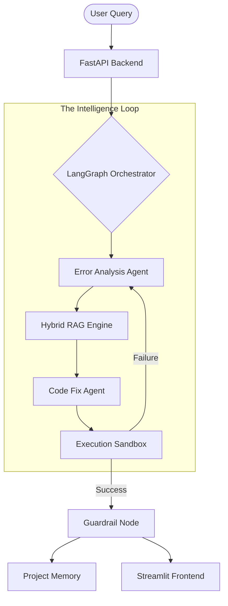

# 🧠 CodeMind AI: Autonomous Multi-Agent Debugging


> **CodeMind AI** is a production-grade, self-correcting debugging platform. It uses a multi-agent orchestration loop to analyze errors, retrieve code context via Hybrid RAG, and execute proposed fixes in a secure sandbox before proposing them to the user.

---

## 🚀 Key Features

*   **⚡ Autonomous Self-Correction**: If a fix fails runtime validation, the agent analyzes the `stderr` and retries automatically.
*   **📂 Hybrid Retrieval (RAG)**: Combines Semantic (FAISS) and Keyword (BM25) search with technical proximity boosting.
*   **🧠 Dynamic Model Escalation**: Intelligently switches between model tiers (8B -> 70B) based on the complexity of the bug.
*   **🛡️ Security Guardrails**: Built-in scanners to detect and block malicious or unsafe AI-generated code snippets.
*   **🤖 Multi-Mode Intelligence**:
    *   `debug`: Active problem solving and code generation.
    *   `explain`: Architectural summaries and data flow analysis.
    *   `impact`: Predictive dependency tracing for refactoring.

---

## 📐 System Architecture



---

## 🛠️ Tech Stack

*   **Core**: Python 3.12, FastAPI
*   **LLM Orchestration**: LangGraph, LangChain
*   **Inference**: Groq (Llama 3.3 70B, Mixtral 8x7B)
*   **Vector DB**: FAISS + HuggingFace Embeddings
*   **Frontend**: Streamlit

---

## 🏁 Quickstart

### 1. Configure Environment
Create a `.env` file with your Groq keys:
```env
GROQ_API_KEY_1=your_key_here
GROQ_API_KEY_2=your_key_here
```

### 2. Launch the Backend
```bash
.\venv\Scripts\python -m uvicorn src.api.main:app --port 8000
```

### 3. Launch the UI
```bash
.\venv\Scripts\streamlit run streamlit_app.py
```

---

## 📁 Repository Structure

```text
src/
├── api/             # FastAPI Endpoints & Routes
├── agents/          # Orchestrator & Specialized AI Agents
├── rag/             # Indexing, Retrieval & Context Ranking
├── services/        # Pipeline & Repo Management
├── memory/          # Session & Project Persistence
└── validation/      # Security Guardrails & Execution Engine
```

---

## 🛡️ Guardrail Audit
Every fix generated by CodeMind AI is audited for:
- **Security**: Blocking `eval`, `exec`, and unsafe `os` calls.
- **Style**: Ensuring Type Hints and project naming conventions.
- **Reliability**: Validated against actual Python runtime in an isolated environment.
